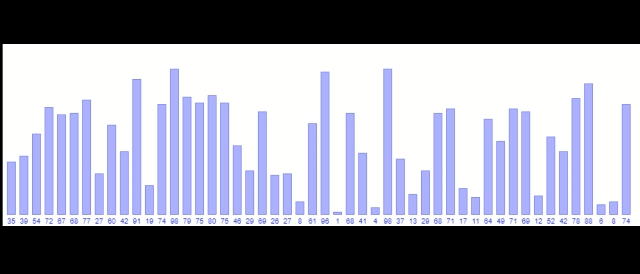

有两个参考资料：

- [https://oi-wiki.org/basic/shell-sort/](https://oi-wiki.org/basic/shell-sort/) 
- https://en.wikipedia.org/wiki/Shellsort

我基本上照着wikipedia写的，Shell排序的复杂度理论分析看来比较复杂，大家都说不好算，oi-wiki上给的证明没看懂，有一些表达不知道是什么意思。国内的网站基本没有认真做复杂度分析的，我本身也不是计算机科班，这个复杂度分析应该算是理论计算机那边的内容，而且Shell排序的复杂度分析好像也比较偏。我这里也只会说个大概，我本身都不懂，大家有好的参考资料可以分享一下。

如果不管Shell排序的复杂度的问题，只考虑怎么写Code，就很简单。Shell排序是插入排序的升级版，先考虑在较大的步长 $s$ 上进行排序，即在 $\cdots,i-s,i,i+s,\cdots$ 上进行排序，再逐步回到较小的步长上，最后一次排序步长要到 $1$ 。

看上去你这最后一步的排序实际上也就是一次完整的插入排序，那插入排序的复杂度是 $O(n^2)$ 啊，实际上这里要考虑到数组已经处于一种"相对有序"的状态，在更大的步长上已经是有序的了，这种有序性可以降低插入排序的复杂度。至于具体怎么降的，我也不知道。

所以要完成Shell排序的Code，我的思路如下

- 写一个带自定义步长的插入排序函数 `insertion_sort_step` 
- 写一个步长序列产生器件 `Gap_sequences_generator` ，接受数组长度，产生从大到小且末值为 $1$ 的步长序列
- 在Shell排序的主程序中，调用 `Gap_sequences_generator` 产生步长序列，遍历步长序列，调用 `insertion_sort_step` 将整个数组按照当前步长间隔排序。